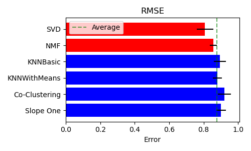
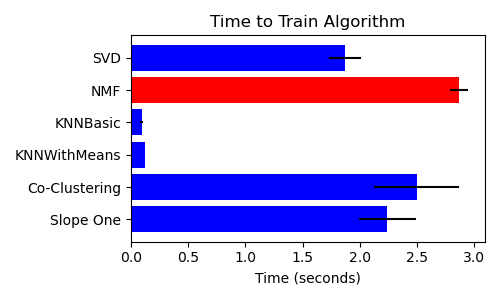
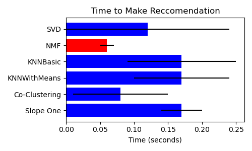
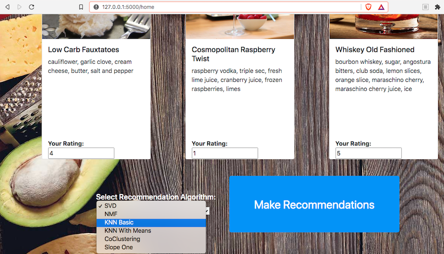
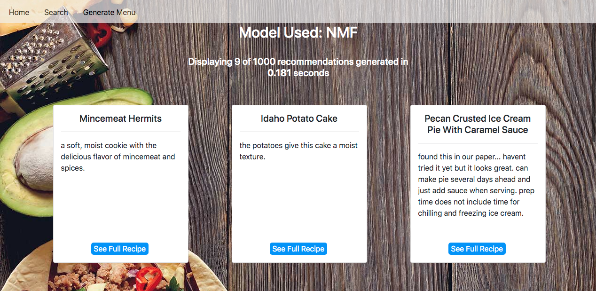
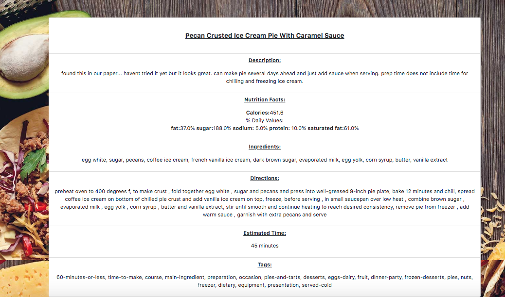
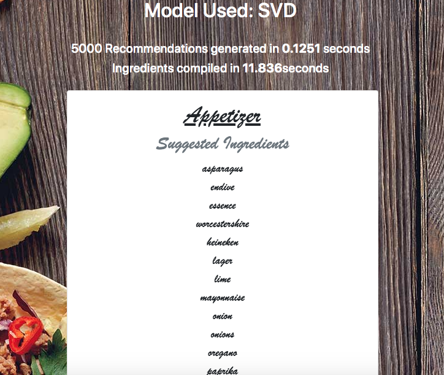

# CHEF MACHINA
By Jordan Fairbanks

As a former Chef, I spent a lot of time writing menus. Continually finding inspiration for recipes is extremely challenging. Machine learning can assist with this task and help chefs write more appealing, personalized menus.

## The Goal

Use a collaborative filerting algorithm to make a recipe recommender based on user ratings, then use natural language processing to help recommend lists of ingredients that a user may enjoy.

## Data

I used the [Food.com Recipes and Interactions](https://www.kaggle.com/shuyangli94/food-com-recipes-and-user-interactions) dataset, which has a compiled list of over 1.1 million individual ratings of thousands of recipes from thousands of users. To  ensure better suggestions, I only used ratings from users who had rated at least 100 recipes. 

## Model Testing

I tested 6 models from the surprise library, SVD, NMF, KNNbasic, KNNWithMeans,  
CoClustering, and SlopeOne.

They all had roughly the same error when predicting, with SVD and NMF doing slightly better than the rest. 

When it came to training times, KNN algorithims trained the fastest.

They payoff for longer training times (at least for SVD and NMF), come with the benfit of faster prediction times.

## Natural Language Processing

So, after we generate recomendations, then what? What sets this apart from just being "The Netflix of Recipes"? 

Once we have some recommended recipes, we can analyze all the information and compile a list of the most commonly seen ingredients. If we add an element of randomness in the recommendation process, we can dynamically generate new and interesting lists of ingredients multiple times for each user. I utilyzed count vectorization to generate ingredient lists for each user, which is fairly basic, but other techniques could easily be incorporated in my pipeline. 

## Web App

I Flask to make a web app that shows these models in action and lets you choose between which underlying algorithm powers the recommendation engine. The landing page lets someone rate a selection of recipes and generate suggestions based on how similarly they rated each item as compared to previous users. 

After choosing a recipe and clicking the "Make Recommendation" button, the model is loaded into the app and used to make predictions from one thousand random recipes from the dataset, and chooses nine to serve back up through the app.

Recipes can be expanded by clicking on the "See Full Recipe" button.

Finally, by entering a user id of a previously known user (what happens behind the scenes whe you sign into netflix), the app can generate a list of ingredients for 6 different courses based on the most popular ingredients from recommendations generated by the underlying model.

## Future Improvements

- Incorporate a classifier model to help classify recipes by course
- Keep track of previous meal and cooking techniques seen by each user
- Add a way to keep track of inventory before making suggestions for ingredients

## Video Presentation/App Demo

Check out [this youtube video](https://youtu.be/Oc5_oisOJIg) for a short presentation and demo of the app.